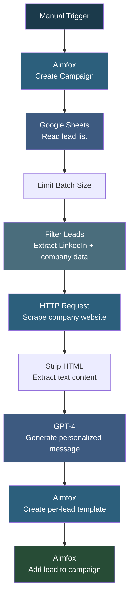

# Aimfox Personalized Messages via AI

## Overview

This automation creates **hyper-personalized LinkedIn outreach messages** for each prospect by actually reading their company's website. It pulls leads from a Google Sheet, visits each company's website, feeds the content to GPT-4, and generates a unique message tailored to that specific business. Each message is saved as an Aimfox template and the lead is added to a LinkedIn campaign automatically. Every prospect gets a message that feels hand-written based on real observations about their company.

## How It Works

```
Manual Trigger -> Create Aimfox Campaign -> Read Leads from Sheet -> Filter Leads -> Scrape Company Website -> Strip HTML -> GPT-4 Generate Message -> Create Aimfox Template -> Add Lead to Campaign
```

### Workflow Diagram



### Workflow Steps

1. **Manual Trigger** - Starts the workflow manually.
2. **Create Aimfox Campaign** - Creates a new Aimfox LinkedIn campaign with today's date in the name.
3. **Google Sheets** - Reads the lead list containing names, titles, companies, LinkedIn URLs, and website domains.
4. **Limit** - Controls batch size to manage API rate limits.
5. **Filter and Prepare Leads** - Extracts leads that have a LinkedIn URL and maps fields to a clean format.
6. **HTTP Request** - Visits each company's website and downloads the raw HTML.
7. **Code (Strip HTML)** - Strips all HTML tags, cleans whitespace, and limits content to 2000 characters for the AI prompt.
8. **GPT-4 Message Generation** - Using the company name, contact's first name, and website content, GPT-4 writes a personalized outreach message. The message observes what the company does, notes potential AI/automation gaps using soft language, and suggests a specific workflow. Tone is human and observational, never salesy.
9. **Create Aimfox Template** - Saves each personalized message as a unique Aimfox template named after the company.
10. **Add Lead to Campaign** - Adds the prospect to the Aimfox campaign with custom variables including the personalized message line.

## Nodes

| Node | Type |
|------|------|
| When clicking 'Execute workflow' | Manual Trigger |
| Create a campaign | Aimfox (create campaign) |
| Get row(s) in sheet | Google Sheets (read) |
| Limit | Limit |
| Filter and Prepare Approved Leads | JavaScript Code |
| HTTP Request | HTTP Request (scrape website) |
| Code in JavaScript | JavaScript (strip HTML) |
| Message a model | OpenAI (GPT-4) |
| Create template | Aimfox (create template) |
| Aimfox - Add Lead to Campaign | Aimfox (add profile) |

## Integrations

- **Google Sheets** - Source of lead data
- **OpenAI (GPT-4)** - Generates personalized outreach messages based on website content
- **Aimfox** - Creates campaigns, templates, and adds leads for LinkedIn outreach

## Setup

1. Import `Aimfox_Personalized_messages_via_AI_.json` into your n8n instance.
2. Update credentials for Google Sheets, OpenAI, and Aimfox.
3. Update the Google Sheet ID to point to your lead list.
4. Customize the GPT-4 system prompt if representing a different company or service.
5. Activate the workflow and click "Execute workflow" to run.
